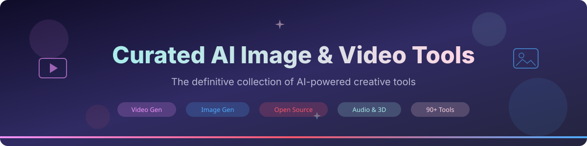

  

<h1 align="center">Curated AI Image & Video Tools</h1>

  <strong>A carefully curated collection of the best AI-powered image and video generation tools, models, and APIs.</strong>

  
  
  
  
  
  
  

  <a href="#video-generation">Video Generation</a> &bull;
  <a href="#video-editing--clipping">Video Editing</a> &bull;
  <a href="#image-generation">Image Generation</a> &bull;
  <a href="#image-editing">Image Editing</a> &bull;
  <a href="#open-source-models">Open Source</a> &bull;
  <a href="#audio--music">Audio</a> &bull;
  <a href="#3d--animation">3D</a> &bull;
  <a href="#contributing">Contributing</a>

---

> **Last updated:** March 2026 &bull; **Tools listed:** 90+ &bull; **Categories:** 9

## Contents

- [Featured: Ssemble AI Clipping](#-featured-ssemble-ai-clipping)
- [Video Generation](#video-generation)
- [Video Editing & Clipping](#video-editing--clipping)
- [Image Generation](#image-generation)
- [Image Editing](#image-editing)
- [Open Source Models](#open-source-models)
- [Audio & Music](#audio--music)
- [3D & Animation](#3d--animation)
- [Face & Avatar](#face--avatar)
- [Upscaling & Enhancement](#upscaling--enhancement)
- [Recently Added](#-recently-added)
- [Related Lists](#related-lists)
- [Contributing](#contributing)

---

## **Featured: Ssemble AI Clipping**

<table>
  <tr>
    <td width="120" align="center">
      <a href="https://www.ssemble.com">
        
         <strong>Ssemble</strong>
      </a>
    </td>
    <td>
      <h3><a href="https://www.ssemble.com">Ssemble AI Video Clipping</a></h3>
      
<strong>The smartest way to turn long-form videos into viral short clips.</strong>

      
Ssemble uses advanced AI to automatically analyze your videos, identify the most engaging moments, and generate perfectly-edited short-form clips ready for TikTok, YouTube Shorts, and Instagram Reels. Features include intelligent scene detection, automatic captions with customizable styles, viral score prediction, and batch processing.

      

        
        
        
      

      

        
<strong>Key Features</strong>

        <ul>
          <li>AI-powered clip detection with viral score prediction</li>
          <li>Automatic caption generation with 20+ customizable templates</li>
          <li>Support for YouTube URLs and direct video uploads</li>
          <li>Hook titles, meme hooks, and background music overlays</li>
          <li>Split-screen gameplay overlays for gaming content</li>
          <li>MCP Server integration for programmatic access</li>
          <li>Batch processing of multiple videos</li>
          <li>Direct publishing to TikTok, YouTube, and Instagram</li>
        </ul>
      

    </td>
  </tr>
</table>

---

## Video Generation

Tools for generating videos from text, images, or other inputs using AI.

| Tool | Description | Pricing | Links |
|------|-------------|---------|-------|
| **[Sora](https://openai.com/sora)** | OpenAI's text-to-video and image-to-video model. Generates realistic and imaginative scenes from text instructions up to 1080p resolution. | Included with ChatGPT Plus/Pro | [Blog](https://openai.com/index/sora/) |
| **[Runway Gen-3 Alpha](https://runwayml.com)** | State-of-the-art video generation with fine-grained temporal control, text-to-video, and image-to-video capabilities. | Free tier + paid plans from $12/mo | [Docs](https://docs.runwayml.com/) &bull; [Research](https://research.runwayml.com/) |
| **[Kling AI](https://klingai.com)** | Kuaishou's advanced text-to-video and image-to-video model producing high-quality cinematic clips up to 2 minutes. | Free tier available | [Demo](https://klingai.com) |
| **[Pika](https://pika.art)** | Creative AI video platform for generating and editing videos from text and images with style control. | Free tier + Pika Pro from $8/mo | [Discord](https://discord.gg/pika) |
| **[Luma Dream Machine](https://lumalabs.ai/dream-machine)** | Fast, high-quality video generation from text and images with realistic physics and motion. | Free tier + paid plans | [API](https://docs.lumalabs.ai/) |
| **[Vidu](https://www.vidu.studio)** | AI video generation platform by Shengshu Technology, known for consistent character generation and multi-scene composition. | Free tier available | [Website](https://www.vidu.studio) |
| **[Hailuo AI (MiniMax)](https://hailuoai.video)** | MiniMax's video generation model with strong motion quality and text adherence for short-form video content. | Free tier available | [Website](https://hailuoai.video) |
| **[Synthesia](https://www.synthesia.io)** | Enterprise AI video platform with realistic AI avatars, 140+ languages, and custom avatar creation. | From $22/mo | [API](https://docs.synthesia.io/) |
| **[HeyGen](https://www.heygen.com)** | AI video generation platform specializing in talking avatar videos for marketing, training, and communication. | Free tier + from $24/mo | [API Docs](https://docs.heygen.com/) |
| **[D-ID](https://www.d-id.com)** | AI-powered video creation platform that transforms photos into talking head videos with natural speech. | Free tier + from $5.90/mo | [API](https://docs.d-id.com/) |
| **[Veo 2](https://deepmind.google/technologies/veo/)** | Google DeepMind's video generation model available through Vertex AI, producing high-fidelity 1080p videos. | Via Google Cloud | [Blog](https://blog.google/technology/google-labs/veo-2/) |
| **[Pixverse](https://pixverse.ai)** | AI video creation platform with text-to-video, image-to-video, and video style transfer capabilities. | Free tier available | [Website](https://pixverse.ai) |
| **[Haiper](https://haiper.ai)** | AI video generation with perceptual foundation models, supporting text-to-video and video animation. | Free tier available | [Website](https://haiper.ai) |
| **[Genmo Mochi](https://www.genmo.ai)** | Open-source video generation with Mochi 1 model, supporting high-quality text-to-video synthesis. | Free tier + paid plans | [GitHub](https://github.com/genmoai/mochi) |

## Video Editing & Clipping

AI-powered tools for editing, clipping, and repurposing video content.

| Tool | Description | Pricing | Links |
|------|-------------|---------|-------|
| **[Ssemble](https://www.ssemble.com)** | **AI-powered video clipping platform** that automatically identifies the best moments from long-form videos and creates viral short-form clips with captions, hook titles, and music. Features MCP Server integration for programmatic access. | Free tier + paid plans | [MCP Server](https://www.npmjs.com/package/@ssemble/mcp-server) &bull; [Docs](https://www.ssemble.com) |
| **[Descript](https://www.descript.com)** | All-in-one video editor with AI transcription, text-based editing, screen recording, and AI voice cloning. Edit video by editing text. | Free tier + from $24/mo | [Docs](https://www.descript.com/help) |
| **[CapCut](https://www.capcut.com)** | ByteDance's feature-rich video editor with AI-powered auto-captions, background removal, and effects. Available on web, desktop, and mobile. | Free + Pro from $7.99/mo | [Website](https://www.capcut.com) |
| **[Opus Clip](https://www.opus.pro)** | AI-powered tool that repurposes long videos into short viral clips, with automatic reframing and caption generation. | Free tier + from $19/mo | [Website](https://www.opus.pro) |
| **[Vizard AI](https://vizard.ai)** | AI video clipping tool that transforms long-form content into bite-sized clips optimized for social media platforms. | Free tier + from $16/mo | [Website](https://vizard.ai) |
| **[Pictory](https://pictory.ai)** | AI video creation platform that converts scripts, articles, and long videos into short branded videos with AI editing. | From $19/mo | [Website](https://pictory.ai) |
| **[Kapwing](https://www.kapwing.com)** | Online collaborative video editor with AI-powered tools including auto-subtitles, smart cut, and background removal. | Free tier + from $16/mo | [Docs](https://www.kapwing.com/resources) |
| **[Riverside](https://riverside.fm)** | High-quality recording and AI editing platform for podcasts and video, with automatic transcription and clip creation. | Free tier + from $15/mo | [Website](https://riverside.fm) |
| **[Veed.io](https://www.veed.io)** | Online video editor with AI subtitles, text-to-speech, background removal, and one-click video creation tools. | Free tier + from $18/mo | [Website](https://www.veed.io) |
| **[InVideo AI](https://invideo.io)** | AI-powered video creation platform that generates ready-to-publish videos from text prompts with stock footage and voiceover. | Free tier + from $25/mo | [Website](https://invideo.io) |

## Image Generation

AI models and platforms for creating images from text descriptions or other inputs.

| Tool | Description | Pricing | Links |
|------|-------------|---------|-------|
| **[Midjourney](https://www.midjourney.com)** | Industry-leading AI image generation known for artistic quality, coherent compositions, and photorealism. Available via Discord and web. | From $10/mo | [Docs](https://docs.midjourney.com/) |
| **[DALL-E 3](https://openai.com/dall-e-3)** | OpenAI's latest image generation model with improved text rendering, prompt following, and safety features. Integrated into ChatGPT. | Via ChatGPT Plus ($20/mo) or API | [API](https://platform.openai.com/docs/guides/images) |
| **[Stable Diffusion 3.5](https://stability.ai)** | Stability AI's latest open-weight image generation model with improved typography, prompt adherence, and quality. | Open weights + API access | [Hugging Face](https://huggingface.co/stabilityai) &bull; [API](https://platform.stability.ai/) |
| **[FLUX.1](https://blackforestlabs.ai)** | Black Forest Labs' state-of-the-art text-to-image model available in Pro, Dev, and Schnell variants with excellent prompt adherence. | Open source (Schnell) + API | [GitHub](https://github.com/black-forest-labs/flux) &bull; [HF](https://huggingface.co/black-forest-labs) |
| **[Ideogram](https://ideogram.ai)** | AI image generation excelling at text rendering within images, logos, and typography-heavy designs. | Free tier + from $8/mo | [Website](https://ideogram.ai) |
| **[Leonardo AI](https://leonardo.ai)** | Platform for generating production-quality visual assets with fine-tuned models and advanced control features. | Free tier + from $12/mo | [Docs](https://docs.leonardo.ai/) |
| **[Adobe Firefly](https://www.adobe.com/products/firefly.html)** | Adobe's generative AI model family trained on licensed content, integrated into Creative Cloud applications. | Included with Adobe CC + standalone plans | [API](https://developer.adobe.com/firefly-services/) |
| **[Google Imagen 3](https://deepmind.google/technologies/imagen-3/)** | Google DeepMind's highest quality text-to-image model with photorealistic output and strong text rendering. | Via Google Cloud / Gemini | [Vertex AI](https://cloud.google.com/vertex-ai/generative-ai/docs/image/overview) |
| **[Recraft V3](https://www.recraft.ai)** | Professional-grade AI image generation with fine control over style, brand consistency, and vector graphics output. | Free tier + paid plans | [API](https://www.recraft.ai/docs) |
| **[Playground AI](https://playground.com)** | AI image generation and editing platform with mixed image editing, canvas workflow, and community sharing. | Free tier + from $15/mo | [Website](https://playground.com) |
| **[Krea AI](https://www.krea.ai)** | Real-time AI image generation and enhancement with upscaling, visual search, and AI-trained pattern generation. | Free tier + from $24/mo | [Website](https://www.krea.ai) |
| **[NightCafe](https://nightcafe.studio)** | AI art generation platform with multiple AI models (SDXL, DALL-E, Stable Diffusion) and community features. | Free credits + from $5.99/mo | [Website](https://nightcafe.studio) |

## Image Editing

AI-powered tools for editing, enhancing, and manipulating existing images.

| Tool | Description | Pricing | Links |
|------|-------------|---------|-------|
| **[Adobe Photoshop (Generative Fill)](https://www.adobe.com/products/photoshop.html)** | Industry-standard image editor with AI-powered Generative Fill, Generative Expand, and neural filters. | From $22.99/mo | [Features](https://www.adobe.com/products/photoshop/generative-fill.html) |
| **[Canva AI](https://www.canva.com)** | Design platform with Magic Studio AI features including Magic Edit, Magic Eraser, text-to-image, and Magic Write. | Free tier + Pro from $12.99/mo | [AI Features](https://www.canva.com/magic/) |
| **[Remove.bg](https://www.remove.bg)** | Specialized AI tool for instant, high-quality background removal from images with API access. | Free tier + from $0.20/image | [API](https://www.remove.bg/api) |
| **[Clipdrop](https://clipdrop.co)** | Stability AI's suite of AI-powered image tools: background removal, relighting, upscaling, uncropping, and cleanup. | Free tier + Pro from $9/mo | [API](https://clipdrop.co/apis) |
| **[Magnific AI](https://magnific.ai)** | AI image upscaler and enhancer that adds realistic detail and texture when scaling images up to 16x resolution. | From $39/mo | [Website](https://magnific.ai) |
| **[Photoroom](https://www.photoroom.com)** | AI-powered photo editor specializing in product photography with background removal, shadow generation, and scene creation. | Free tier + from $12.99/mo | [API](https://www.photoroom.com/api) |
| **[Pixlr](https://pixlr.com)** | Online photo editor with AI-powered tools including background removal, object removal, and batch editing. | Free tier + from $4.90/mo | [Website](https://pixlr.com) |
| **[Luminar Neo](https://skylum.com/luminar)** | AI-powered photo editor with sky replacement, portrait retouching, object removal, and generative AI tools. | From $9.95/mo | [Website](https://skylum.com/luminar) |

## Open Source Models

Free and open-source AI models for image and video generation that you can run locally or self-host.

| Model | Description | Type | Links |
|-------|-------------|------|-------|
| **[Stable Diffusion XL](https://stability.ai)** | Stability AI's powerful open-source text-to-image model with 1024x1024 base resolution and strong community support. | Image Generation | [HF](https://huggingface.co/stabilityai/stable-diffusion-xl-base-1.0) &bull; [GitHub](https://github.com/Stability-AI/generative-models) |
| **[FLUX.1 Schnell](https://blackforestlabs.ai)** | Black Forest Labs' fastest open-source text-to-image model, optimized for speed with Apache 2.0 license. | Image Generation | [HF](https://huggingface.co/black-forest-labs/FLUX.1-schnell) &bull; [GitHub](https://github.com/black-forest-labs/flux) |
| **[AnimateDiff](https://animatediff.github.io)** | Motion module that adds animation capabilities to personalized text-to-image diffusion models without model-specific tuning. | Video Generation | [GitHub](https://github.com/guoyww/AnimateDiff) &bull; [Paper](https://arxiv.org/abs/2307.04725) |
| **[Stable Video Diffusion (SVD)](https://stability.ai)** | Stability AI's open-source image-to-video model that generates short video clips from a single image. | Video Generation | [HF](https://huggingface.co/stabilityai/stable-video-diffusion-img2vid-xt) &bull; [Paper](https://arxiv.org/abs/2311.15127) |
| **[CogVideo / CogVideoX](https://github.com/THUDM/CogVideo)** | Tsinghua University's open-source text-to-video generation model with strong temporal consistency. | Video Generation | [GitHub](https://github.com/THUDM/CogVideo) &bull; [HF](https://huggingface.co/THUDM/CogVideoX-5b) |
| **[Open-Sora](https://github.com/hpcaitech/Open-Sora)** | Open-source reproduction of OpenAI Sora-like video generation, democratizing efficient video production. | Video Generation | [GitHub](https://github.com/hpcaitech/Open-Sora) &bull; [Demo](https://github.com/hpcaitech/Open-Sora#demo) |
| **[Mochi 1](https://github.com/genmoai/mochi)** | Genmo's open-source video generation model with state-of-the-art motion quality and prompt adherence. | Video Generation | [GitHub](https://github.com/genmoai/mochi) &bull; [HF](https://huggingface.co/genmo/mochi-1-preview) |
| **[LTX-Video](https://github.com/Lightricks/LTX-Video)** | Lightricks' open-source real-time video generation model running faster than real-time on a single GPU. | Video Generation | [GitHub](https://github.com/Lightricks/LTX-Video) &bull; [HF](https://huggingface.co/Lightricks/LTX-Video) |
| **[HunyuanVideo](https://github.com/Tencent/HunyuanVideo)** | Tencent's open-source video generation foundation model with high visual quality and diverse content generation. | Video Generation | [GitHub](https://github.com/Tencent/HunyuanVideo) &bull; [Paper](https://arxiv.org/abs/2412.03603) |
| **[ControlNet](https://github.com/lllyasviel/ControlNet)** | Neural network structure for adding spatial conditioning controls to diffusion models (pose, depth, edges). | Image Control | [GitHub](https://github.com/lllyasviel/ControlNet) &bull; [Paper](https://arxiv.org/abs/2302.05543) |
| **[IP-Adapter](https://ip-adapter.github.io)** | Text-compatible image prompt adapter for existing diffusion models enabling image-guided generation. | Image Control | [GitHub](https://github.com/tencent-ailab/IP-Adapter) &bull; [Paper](https://arxiv.org/abs/2308.06721) |
| **[ComfyUI](https://www.comfy.org)** | Powerful and modular node-based GUI for diffusion model workflows with extensive community plugins. | Interface/Workflow | [GitHub](https://github.com/comfyanonymous/ComfyUI) |
| **[Automatic1111 WebUI](https://github.com/AUTOMATIC1111/stable-diffusion-webui)** | Popular Gradio-based web UI for Stable Diffusion with extensive features and extensions ecosystem. | Interface/Workflow | [GitHub](https://github.com/AUTOMATIC1111/stable-diffusion-webui) |

## Audio & Music

AI tools for generating music, sound effects, voice, and audio content.

| Tool | Description | Pricing | Links |
|------|-------------|---------|-------|
| **[Suno](https://suno.com)** | AI music generation platform that creates full songs with vocals, instruments, and lyrics from text prompts. | Free tier + from $8/mo | [Website](https://suno.com) |
| **[Udio](https://www.udio.com)** | AI music creation tool producing high-quality songs across genres with vocals and instrumentation from text descriptions. | Free tier + from $8/mo | [Website](https://www.udio.com) |
| **[ElevenLabs](https://elevenlabs.io)** | Leading AI voice platform with ultra-realistic text-to-speech, voice cloning, dubbing, and sound effects generation. | Free tier + from $5/mo | [API](https://elevenlabs.io/docs) |
| **[Bark](https://github.com/suno-ai/bark)** | Open-source text-to-audio model by Suno that generates realistic speech, music, background noise, and sound effects. | Free (open source) | [GitHub](https://github.com/suno-ai/bark) &bull; [HF](https://huggingface.co/suno/bark) |
| **[MusicGen](https://audiocraft.metademolab.com/musicgen.html)** | Meta's open-source music generation model conditioned on text descriptions or melody references. | Free (open source) | [GitHub](https://github.com/facebookresearch/audiocraft) &bull; [HF](https://huggingface.co/facebook/musicgen-large) |
| **[Stable Audio](https://stability.ai/stable-audio)** | Stability AI's AI music and sound effects generation model producing high-quality 44.1kHz stereo audio. | Free tier + from $11.99/mo | [Website](https://stableaudio.com/) |
| **[AIVA](https://www.aiva.ai)** | AI music composition assistant that creates original soundtracks for films, games, and creative projects. | Free tier + from $11/mo | [Website](https://www.aiva.ai) |
| **[Mubert](https://mubert.com)** | AI-generated royalty-free music for content creators, brands, and developers with real-time generation. | Free tier + from $14/mo | [API](https://mubert.com/api) |

## 3D & Animation

AI tools for creating 3D models, scenes, and animations.

| Tool | Description | Pricing | Links |
|------|-------------|---------|-------|
| **[Meshy](https://www.meshy.ai)** | AI 3D model generation from text or images with automatic texturing, supporting multiple export formats. | Free tier + from $16/mo | [API](https://docs.meshy.ai/) |
| **[Tripo AI](https://www.tripo3d.ai)** | Fast AI-powered 3D model generation from text or single images with high-quality mesh output. | Free tier + from $9.90/mo | [Website](https://www.tripo3d.ai) |
| **[Luma Genie](https://lumalabs.ai/genie)** | Text-to-3D generation using Luma's neural radiance fields, creating detailed 3D assets from descriptions. | Via Luma platform | [Website](https://lumalabs.ai/genie) |
| **[Point-E](https://github.com/openai/point-e)** | OpenAI's open-source system for generating 3D point clouds from text prompts efficiently. | Free (open source) | [GitHub](https://github.com/openai/point-e) &bull; [Paper](https://arxiv.org/abs/2212.08751) |
| **[Shap-E](https://github.com/openai/shap-e)** | OpenAI's open-source model for generating 3D objects conditioned on text or images with implicit representations. | Free (open source) | [GitHub](https://github.com/openai/shap-e) &bull; [Paper](https://arxiv.org/abs/2305.02463) |
| **[Spline AI](https://spline.design)** | 3D design tool with AI-powered generation, texturing, and animation for web and app experiences. | Free tier + from $7/mo | [Website](https://spline.design) |
| **[3DFY AI](https://3dfy.ai)** | Enterprise AI platform for generating production-ready 3D models from text at scale. | Enterprise pricing | [Website](https://3dfy.ai) |
| **[Kaedim](https://www.kaedim3d.com)** | AI-powered 2D-to-3D conversion tool that transforms images and sketches into production-ready 3D models. | From $29/mo | [Website](https://www.kaedim3d.com) |

## Face & Avatar

AI tools for creating realistic digital humans, avatars, and face-related content.

| Tool | Description | Pricing | Links |
|------|-------------|---------|-------|
| **[HeyGen](https://www.heygen.com)** | AI avatar video platform with 100+ customizable avatars, video translation in 40+ languages, and voice cloning. | Free tier + from $24/mo | [API](https://docs.heygen.com/) |
| **[Synthesia](https://www.synthesia.io)** | Enterprise AI avatar platform with 230+ diverse avatars, 140+ languages, and custom avatar creation from video. | From $22/mo | [API](https://docs.synthesia.io/) |
| **[D-ID](https://www.d-id.com)** | Creative AI platform that transforms photos into talking head videos with natural facial animation and speech. | Free tier + from $5.90/mo | [API](https://docs.d-id.com/) |
| **[LivePortrait](https://github.com/KwaiVGI/LivePortrait)** | Open-source efficient portrait animation framework enabling controllable facial expression transfer. | Free (open source) | [GitHub](https://github.com/KwaiVGI/LivePortrait) &bull; [Paper](https://arxiv.org/abs/2407.03168) |
| **[Hedra](https://www.hedra.com)** | AI character video generation that creates talking avatar videos from a single photo and audio input. | Free tier + paid plans | [Website](https://www.hedra.com) |
| **[Akool](https://akool.com)** | AI-powered face swap, talking avatar, and personalized video generation platform for marketing and creative use. | Free tier + from $30/mo | [Website](https://akool.com) |
| **[DeepFaceLab](https://github.com/iperov/DeepFaceLab)** | Open-source deepfake tool for face swapping and aging with extensive community and research applications. | Free (open source) | [GitHub](https://github.com/iperov/DeepFaceLab) |
| **[Artflow AI](https://www.artflow.ai)** | AI-powered animated avatar and story creation platform with consistent character generation across scenes. | Free tier + paid plans | [Website](https://www.artflow.ai) |

## Upscaling & Enhancement

AI tools for improving image and video quality, resolution, and detail.

| Tool | Description | Pricing | Links |
|------|-------------|---------|-------|
| **[Topaz Photo AI](https://www.topazlabs.com/topaz-photo-ai)** | Professional AI image enhancer with noise reduction, sharpening, and upscaling up to 6x with detail recovery. | $199 (one-time) | [Website](https://www.topazlabs.com/topaz-photo-ai) |
| **[Topaz Video AI](https://www.topazlabs.com/topaz-video-ai)** | Professional AI video upscaler and enhancer for upscaling footage up to 16K with frame interpolation and stabilization. | $299 (one-time) | [Website](https://www.topazlabs.com/topaz-video-ai) |
| **[Real-ESRGAN](https://github.com/xinntao/Real-ESRGAN)** | Open-source practical image/video restoration tool with state-of-the-art upscaling for real-world images. | Free (open source) | [GitHub](https://github.com/xinntao/Real-ESRGAN) &bull; [Paper](https://arxiv.org/abs/2107.10833) |
| **[Magnific AI](https://magnific.ai)** | AI upscaler that reimagines and adds photorealistic detail when upscaling images by up to 16x. | From $39/mo | [Website](https://magnific.ai) |
| **[Upscayl](https://upscayl.org)** | Free and open-source AI image upscaler built with Linux-first philosophy, available on all platforms. | Free (open source) | [GitHub](https://github.com/upscayl/upscayl) |
| **[Waifu2x](https://github.com/nagadomi/waifu2x)** | Classic open-source neural network for anime-style image super-resolution and noise reduction. | Free (open source) | [GitHub](https://github.com/nagadomi/waifu2x) |

---

## Recently Added

> New tools and updates added in 2026:

- **Ssemble MCP Server** - Programmatic AI video clipping via Model Context Protocol ([npm](https://www.npmjs.com/package/@ssemble/mcp-server))
- **FLUX.1 Kontext** - Black Forest Labs' latest model for text-guided image editing and generation
- **Veo 2** - Google DeepMind's video generation model with 1080p output
- **Stable Diffusion 3.5** - Latest open-weight image generation from Stability AI
- **HunyuanVideo** - Tencent's open-source video generation foundation model
- **Kling AI 1.6** - Major update with improved motion quality and longer generation
- **Sora** - OpenAI's video generation model now publicly available

---

## Related Lists

- [awesome-generative-ai](https://github.com/steven2358/awesome-generative-ai) - A curated list of modern generative AI projects and services
- [awesome-stable-diffusion](https://github.com/awesome-stable-diffusion/awesome-stable-diffusion) - Curated list of Stable Diffusion resources
- [awesome-chatgpt](https://github.com/humanloop/awesome-chatgpt) - Curated list of ChatGPT resources
- [awesome-ai-agents](https://github.com/e2b-dev/awesome-ai-agents) - A list of AI autonomous agents
- [open-source-ai](https://github.com/eugeneyan/open-llms) - A list of open LLMs available for commercial use

---

## Contributing

Contributions are welcome! Please read the [contributing guidelines](CONTRIBUTING.md) first.

### How to contribute

1. Fork the repository
2. Create your feature branch (`git checkout -b add-new-tool`)
3. Add your tool to the appropriate category in alphabetical order
4. Ensure the link is working and the description is accurate
5. Submit a pull request

### Quality standards

- Tools must be publicly available (even if paid)
- Links must point to the official website or repository
- Descriptions should be concise but informative
- Each entry should include accurate pricing information

See [CONTRIBUTING.md](CONTRIBUTING.md) for full details.

---

## License

This list is released under [MIT License](LICENSE). The tools listed are property of their respective owners.

---

  If you found this list helpful, please <a href="https://github.com/awesome-ai-tools/curated-ai-image-video">give it a star</a>!

